# Setting up dbt Cloud

**Requirements**
- From [Setting up Google Cloud and BigQuery](setting_up_gcp_and_bigquery.md)
    - The *stroopwafelshopdata* BigQuery dataset
    - The *dbt-cloud* service account with IAM permissions for BigQuery
    - The *dbt-cloud* service account’s JSON key file

**Intro**

This is the step-by-step guide to set up dbt Cloud for modeling the Stroopwafelshop data. It
contains the following sections:

1. Creating a dbt Cloud account
2. Setting up the connection to Google BigQuery
3. Initializing the project
4. Creating a branch
5. Testing the connection
6. Building the example model
8. Deleting the example models
9. Potential issues

Let’s start!

**Creating a dbt Cloud account**

Create a dbt cloud account at https://cloud.getdbt.com/signup/. You can use the same
email you used to sign up for Google Cloud. dbt Cloud offers a free plan for a single user,
perfect for our needs, refer to https://www.getdbt.com/pricing/ for more information on
the pricing plans. Choose *stroopwafelshop* as the company name when creating your
account.

Next, you will be asked to create a new project. You can name it *stroopwafelshop*, 
and continue setting up a connection to the data warehouse.

**Setting up the connection to BigQuery**

dbt Cloud needs a connection to a database or data warehouse to function. You will see the
icons of the different supported data warehouses, as shown in Figure 1. Additional data
warehouses are supported by the dbt open-source package. The connectors to different
warehouses, databases or data platforms are called adapters. You can view the full range of
adapters here: https://docs.getdbt.com/docs/supported-data-platforms.

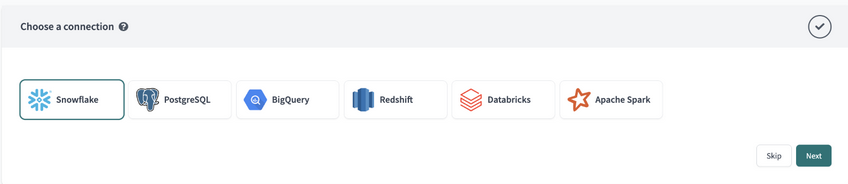
<p align="center">Figure 1 - Supported data warehouses in dbt Cloud</p>


Now, select **BigQuery**. In the following screen you will be asked for credentials (as shown in Figure 2). We will use the service account key file that you created earlier for the *dbt-cloud* service account.

Next, locate the *dbt-cloud* service account key file on your computer, and select **Upload a Service Account JSON** file to upload it into the dbt Cloud interface. It should automatically fill in all the empty fields on the page.

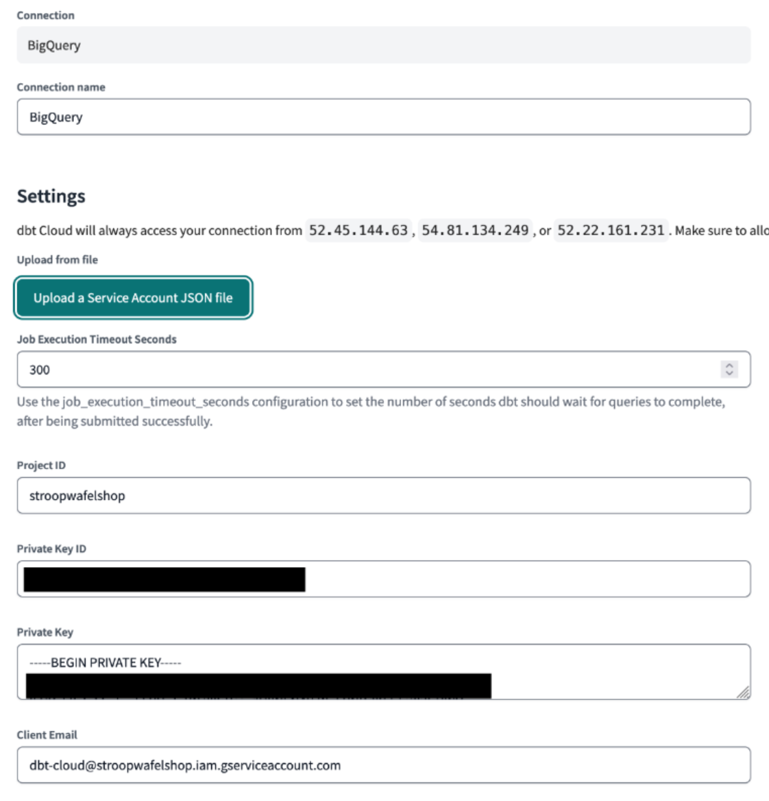
<p align="center">Figure 2 - Uploading the service account JSON file</p>


Then scroll all the way to the bottom of the page. The only thing you should adjust is the **Dataset** name. Change it to *dbt_firstname_lastname*, filling in your personal information.

In dbt, each developer should have their own dedicated dataset (called *schema* in other data warehouses) in which they develop. Each developer will always have their own copy of the master data to work with. Each time you run dbt, the source data is read, and the SQL transformations are applied.  The resulting tables and views are then placed in your dataset.  Once you are happy with your code, you can promote the code to be run on the dedicated “production” dataset, which is available for consumption by end users.

Next, select **Test Connection**. If everything was successful, select on **Next**.

Now we will have to set up a code repository.  All the code in dbt lives in a repository, which is essentially a version-controlled folder.  This is similar to a Google Drive folder in the way that every change in this folder is tracked and it is possible to replay changes inside of it. However, unlike a Google Drive folder, a repository is meant to be used with *Git*, which is the de facto standard of version control systems for working with code.

Git provides powerful features that make collaborating with multiple developers easier. You can read up on Git’s features and its use in dbt Cloud on https://docs.getdbt.com/docs/collaborate/git-version-control. These repositories can be created and hosted on different platforms, one of the most popular being Microsoft’s GitHub. dbt Labs even open-sources the code that runs dbt on GitHub: https://github.com/dbt-labs/dbt-core.

> Notes on  GitHub
>
> Alternatively, you can create your own repository on GitHub, and copy the dbt project code from the current repository into your own. This way, all your changes are automatically stored in your GitHub repository, instead of in dbt's "Managed" repository. However, this requires some extra setup like [creating a GitHub repository](https://docs.github.com/en/repositories/creating-and-managing-repositories/creating-a-new-repository), and [creating a connection to GitHub](https://docs.getdbt.com/docs/cloud/git/connect-github), which is not part of the scope of this tutorial.
>

For now, we will make use of dbt’s own Managed hosting for the repository. Type in *stroopwafelshop* as the name, as shown in Figure 3a.

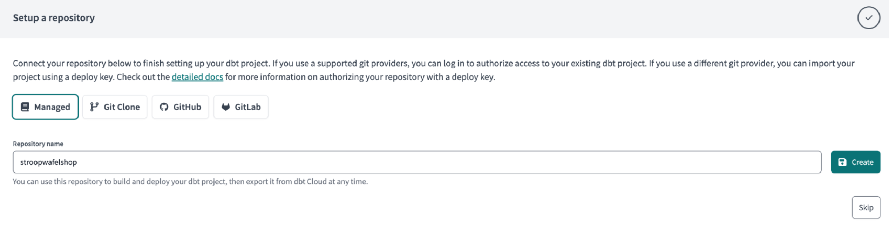
<p align="center">Figure 3a - Repository hosting in dbt</p>

Then scroll down to the **Location** field, and add `EU` (as shown in Figure 3b) since that is the location of the BigQuery dataset.

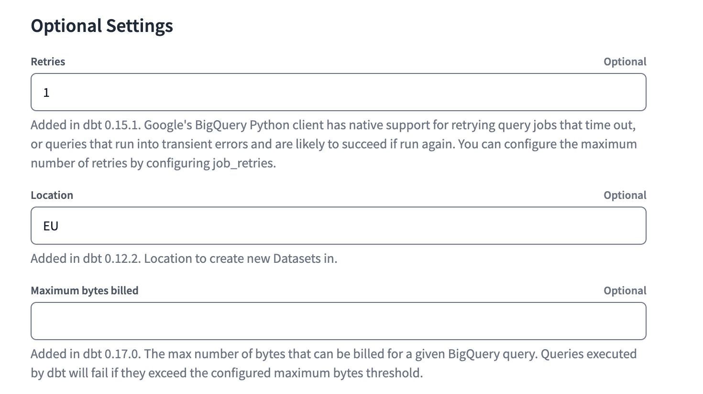
<p align="center">Figure 3b - Selecting the 'EU' location</p>

Finally, select **Create**. This will create the project. In the next screen, click on **Start developing in the IDE**. This will bring you into the Integrated Development Environment, also known as the IDE, as shown in Figure 4.

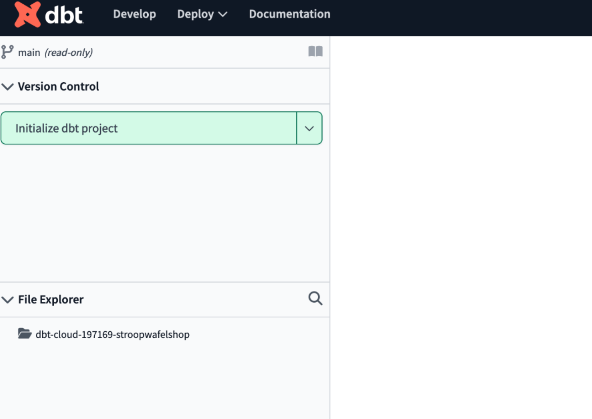
<p align="center">Figure 4 - The dbt Cloud IDE</p>

An IDE is a tool for developers to write, run, and debug code. Some IDEs are specific to a
certain programming language while others support multiple languages. Software engineers
have been using IDEs for decades to produce reliable software and modern IDEs are full of
helpful features that you cannot get with a text editor or command line interface. Some of
the most popular IDEs include Microsoft Visual Studio Code and IntelliJ IDEA, which both
have free versions.

Since all of the dbt project’s code lives inside a repository, and the open-
source version of dbt is a Python package that is usable from the command line, it is
possible to download both to your local machine and use an IDE of your own choice. In fact,
plenty of analytics engineers do this. However, if an IDE is a new concept to you then dbt
Cloud’s browser-based IDE offers a gentle introduction to working with one. Read more
about the dbt Cloud IDE on https://docs.getdbt.com/docs/cloud/dbt-cloud-ide/develop-in-the-cloud.

**Initializing the project**

Next, in the top-left corner, select **Initialize dbt project** button. This will set up the project and create all the files necessary in the **File Explorer**.

After initializing the project, you will see many new files and folders in the *File explorer* screen. These are the project files required for running dbt. dbt Cloud has created these files for you, and you can start modifying them later on. Another interesting window is the **Changes** part on the left. It shows all changes that have been made to the project, and allows you to commit (save) them to the repository. We can see that the files generated by dbt Cloud are in there, ready to be committed, as shown in Figure 5.

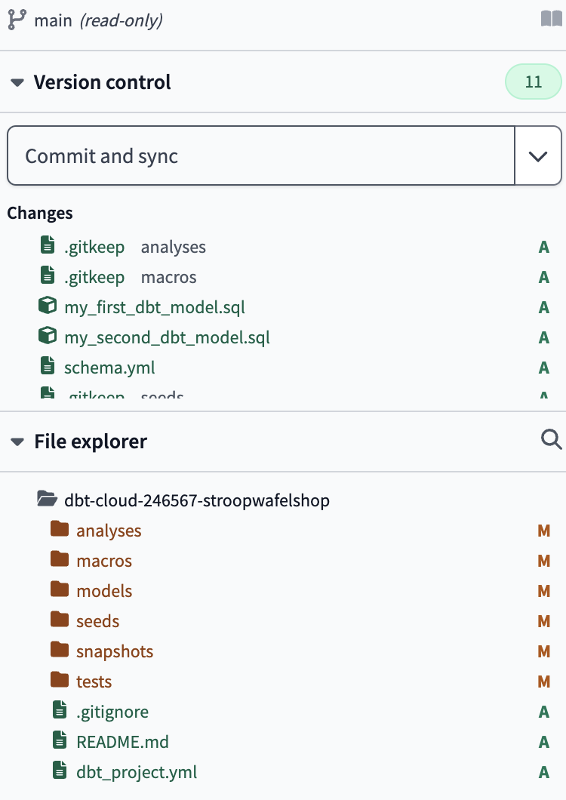
<p align="center">Figure 5 - Changes ready for commiting</p>

Select **Commit and sync** to store these changes in the repository. This is the equivalent of saving your work in a text editor. You will be asked to write a commit message, which is a short description of the changes you made. This is useful for tracking what you did. This is a common practice in software development, and it is a good habit to get into. However, for now, fill in *Initialized project* and select **Commit Changes**. This will save the changes, and remove the files from the **Changes** window. The button will also change to **Create branch**. 

**Creating a branch**

A *branch* is a copy of the code that you can work on without affecting the main code, which lives in the `main` branch. This way, multiple developers can work in their own branch without interfering with each other. Think of it as having a single "main" Excel file that multiple people want to work on. A branch is similar to making a copy of this main Excel document, then making changes in your own copy, and then bringing these changes, once approved, back to the main file. This is also known as  *merging back into main*. Using this workflow, multiple developers can work simultaniosuly on their copies of the code (branches) without clashing/overwriting the main code (main branch).

> Note: Branch != Target schema (Dataset)
>
> Note that a branch in dbt Cloud is not the same as your [target schema](https://docs.getdbt.com/faqs/Project/which-schema). A branch is a copy of the code, while the target schema (dataset in BigQuery), is the holder of tables and views in your data warehouse. The branch is used to manage changes to the code, while the schema is used to manage the data. Think of the branch as a copy of the code, and the schema as a copy of the data.

In dbt Cloud, you are required to create a branch before you can create new files, folders or make changes to existing files. Click on **Create branch** to create a new branch. You will be asked to name the branch. Fill in your name (for me it's `lbenninga`) and select **Create branch** (as shown in Figure 6).

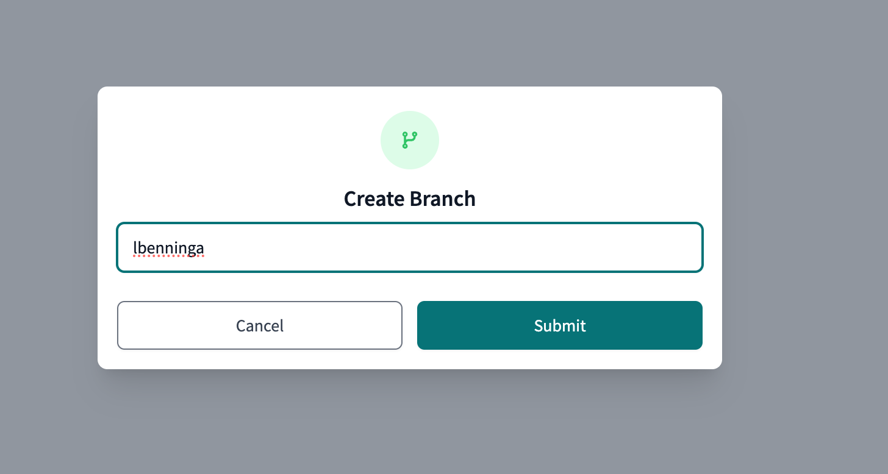
<p align="center">Figure 6 - Creating a branch</p>

Next, you will see the name of your branch in the top-left corner (`lbenninga` for me), and there are no longer any files in the **Changes** window as shown in Figure 7.

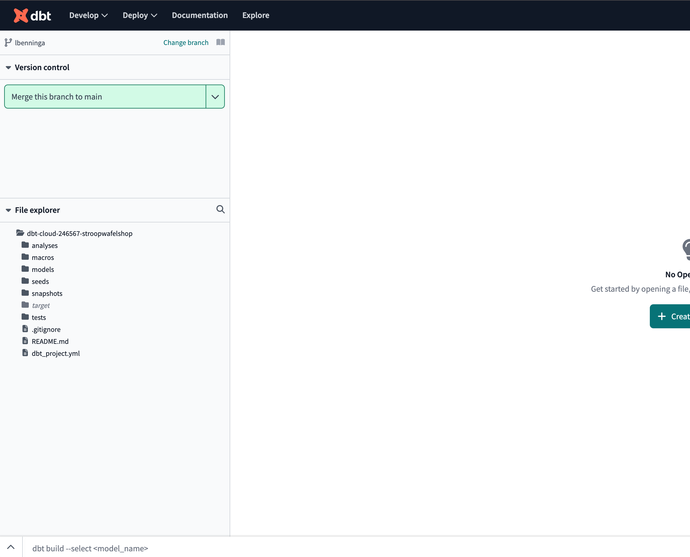
<p align="center">Figure 7 - Newly created branch</p>

 This means that you are ready to start working on the project. Any changes you make, will appear in the changes window, and you can commit them to the branch. Once you are happy with the changes, you can merge them back into the main branch using the **Merge this branch to main** button. Every time you do that, however, you will need to create a new branch again before you can start making changes. This process repeats itself everytime you want to sync changes to the main branch.
 
 However, for the duration of chapter 8 it will not be necessary to merge into `main` until the very end of the chapter. Until then, you can keep saving and committing files into your own branch. For now, we will leave the branch as it is, and move on to the next step, which is testing the connection to BigQuery.


**Testing the BigQuery Connection**

Let's test that the connection from dbt Cloud to BigQuery is working and that we can access the
data. Select **Create New File** in the center of the screen and enter the following SQL query:

```
select * from stroopwafelshopdata.Employees
```

Make sure that `Employees` is capitalized since BigQuery tables are case-sensitive. Then, select **Preview** at the bottom of the screen. This will select the Employees table from the `stroopwafelshopdata` dataset in BigQuery.

The dbt Cloud IDE will send the SQL to be executed to the data warehouse, in this case
BigQuery, and display the results in the IDE (as shown in Figure 8).

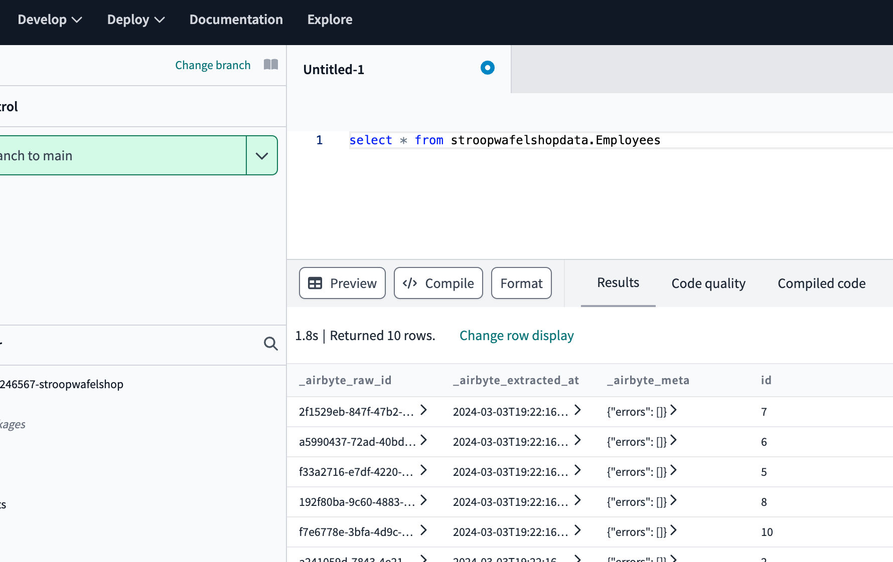
<p align="center">Figure 8 - Testing the connection</p>

Since there are only a few rows returned, all will be displayed. This confirms that the connection works. You can close and disregard the `Untitled-1` file you just created.

**Building the example model**

Next, open up the `models` folder on the left-hand side of the screen. You should see a subfolder named `example`. This contains some example models that dbt Cloud has created for you. Click on `my_first_dbt_model.sql` to open it. It will display the model's code in the center of the screen. Preview it to show the results, as shown in Figure 9.

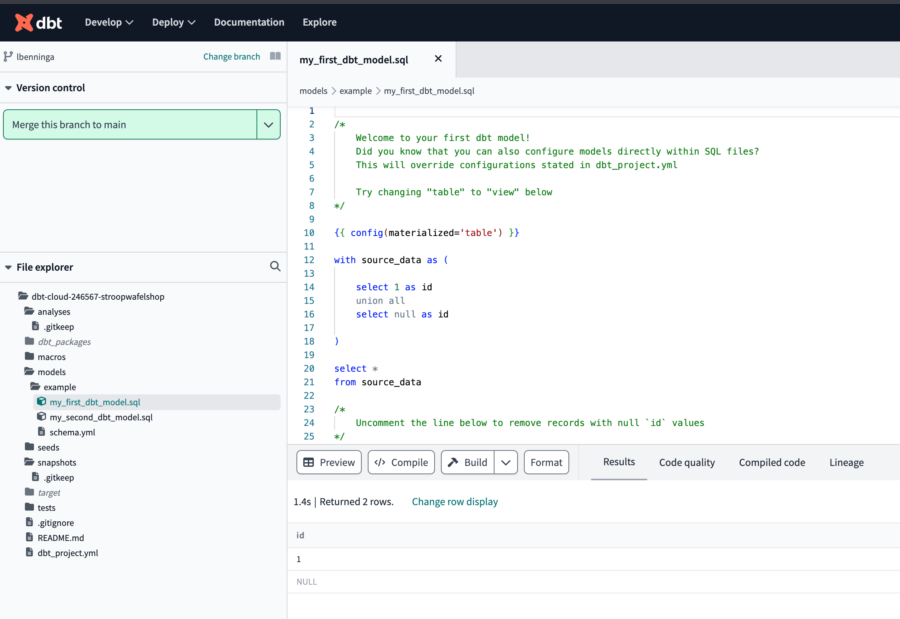
<p align="center">Figure 9 - Previewing the example model</p>


Now, next we will want to *build* the model, which means storing the model's results in the target schema (dataset) in BigQuery. This is commonly referred to as *materializing* the model. This is necessary currently the model only exists as a SQL file in the dbt Cloud IDE, and not as a table/view in BigQuery.

 To do this, we we will first delete the `schema.yml` file since it includes some extra functionality that we don't want right now. Do that by clicking on the three dots next to the `schema.yml` file and selecting **Delete**. Then confirm the deletion by selecting **Delete** in the pop-up window as shown in Figure 10.


<p align="center">Figure 10 - Deleting the `schema.yml`</p>

 Next, try to build the model using the **Build** button. This will create your target schema (`dbt_lbenninga` for me) as a dataset in BigQuery, and then create the `my_first_dbt_model` table inside of it. After building the model, you should see a confirmation message at the left of the screen as shown in Figure 11.


<p align="center">Figure 11 - Building "my_first_dbt_model"</p>

Now, go to BigQuery and check if the model has been materialized. You should see the `my_first_dbt_model` table in the `dbt_lbenninga` dataset, as shown in Figure 12. Both were created when you ran *build* in dbt Cloud.

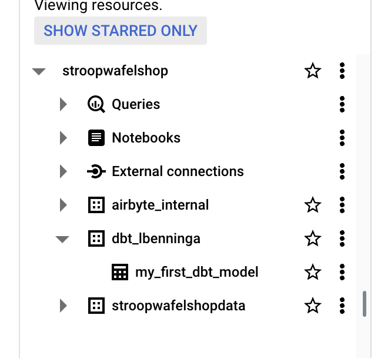
<p align="center">Figure 12 - The model materialized in BigQuery</p>

**Deleting the example models**

From now on, we won't use the example models anymore. In the chapter, we will create our own models. To clean up the project, we will delete the `example` folder. To do this, click on the three dots next to the `example` folder and select **Delete**. Then confirm the deletion by selecting **Delete** in the pop-up window.

 Next, you will see that the deleted files are listed in the changes window, as shown in Figure 13.

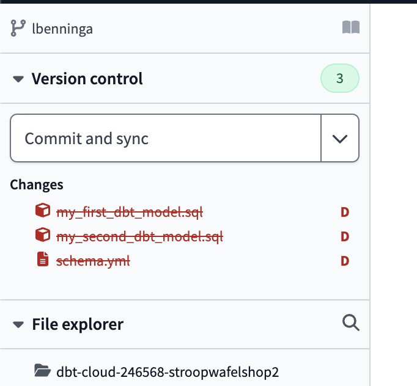
<p align="center">Figure 13 - Committing the deletions</p>

 You can commit this change into your branch by selecting **Commit and sync**. Fill in a commit message, for example *Removed example models*, and select **Commit Changes**. Now, the `example` folder is removed from the branch and the changes are saved. Note however that eventhough we deleted the models in the IDE and saved these changes into our branch, [dbt Cloud will not delete materialized models from the data warehouse](https://docs.getdbt.com/faqs/Models/removing-deleted-models). You will have to do this manually by going back to BigQuery.  There, delete the `my_first_dbt_model` table in the `dbt_lbenninga` dataset as shown in Figure 13.


<p align="center">Figure 14 - Deleting the `my_first_dbt_model` table</p>

Once done, you cleaned up the project and are ready to start modeling the data in dbt Cloud. Check out the potential issues section to handle any issues you might encounter. After that, head back to the chapter to start modeling the Stroopwafelshop data.

## Potential issues

### Errors in the connection to BigQuery

If you encounter errors while trying to preview the query results, these are likely due to an
issue with the BigQuery connection in dbt Cloud, or with the permissions granted to the
service account you are using. Ensure that you followed the steps in [Setting up Google Cloud and BigQuery]() correctly.


### Can't create files or folders, or change existing files

If you encounter this issue, it is most likely that you have not created your own branch yet. You need to create a branch before you can perform any of these actions. The default, `main` branch is read-only and cannot be used for changes. Use the **Create branch** button to create a new branch. If you have created your own branch, ensure that you are working in the correct branch. The name of the branch is displayed in the top-left corner of the IDE. If you are not working in the correct branch, you can switch to another branch by clicking on the branch name and selecting the correct branch from the dropdown menu.

### Can't build any models in your developer schema (dataset) 

If you encounter a message similar to:
```
Dataset stroopwafelshop:dbt_lbenninga was not found in location EU;
```

This most likely means that you did not specify the location of the dataset when setting-up the connection to BigQuery. dbt Cloud will try to create a dataset in the `US` location by default, but since the other datasets are in the `EU` this causes issues. To solve this, perform the following steps:
1. In BigQuery, check that your developer dataset (e.g. `dbt_lbenninga`) has been created in the `US` location. If it has, delete it.
2. Go to the **Account Settings** in dbt by clicking on the "cog" icon in the top-right corner of the screen.
3. Select the **Projects** tab, then select your project, which should be named *stroopwafelshop*.
4. Now, select the **Configure Connection** button. In the new window, you can change the location of the dataset to `EU`. You also need to re-upload the service account JSON file, and then select **Save**. This will update the connection to BigQuery and the dataset location.
5. Go back to the Cloud IDE by clicking the **Develop** button in the top-left corner. This will force the IDE to restart.
6. Now, try to build the model(s) again. It should be able to create your developer dataset (`dbt_lbenninga` for me) in BigQuery, containing the models.
7. Confirm that the dataset has indeed been created in the `EU` location in BigQuery by inspecting it in the BigQuery UI.

### dbt `build` fails

If building a model fails, the error message is not shown directly. In order to see the message, you have to open up the command-line interface using the toggle at the bottom-left of the screen. Please see the video for this.

### dbt CLoud is giving non-sensical errors

Sometimes dbt Cloud can give errors that don't make sense. For example, you might have updated a model but it is still complaining about an old version of the model. This is likely due to a caching issue in dbt Cloud. To solve this, perform the following steps:

1. In the dbt Cloud command line, run `dbt clean`. This will remove all the compiled models and the cache.
2. If the `target` folder in the **File Explorer** view  is not deleted, delete it manually.
3. Try a "restart" of the IDE by clicking the three dots  in the bottom-left corner and select **Restart IDE**. This will force the IDE to restart.

Hopefully this solves it. Luckily, these errors are rare and the IDE is generally very stable. Still, it's good to know how to handle these issues if they occur.
