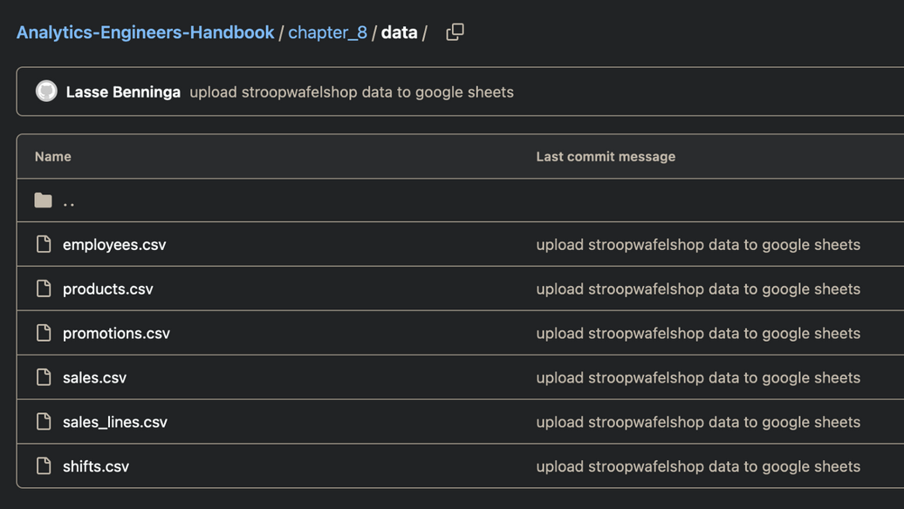
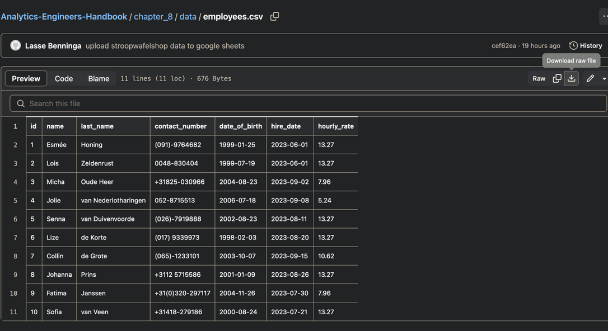
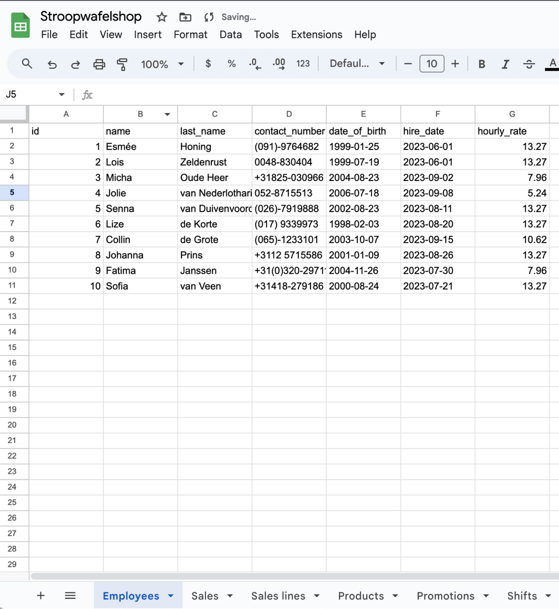

# Uploading the Stroopwafelshop data to Google Sheets

**Requirements**
- A Google account is required to use Google Sheets

**Intro**

This is the step-by-step guide to set upload the Stroopwafelshop data to Google Sheets so it
can be used in Chapter 8 - Hands-on Analytics Engineering. It contains the following
sections:

1. Spreadsheets and Google Sheets
2. Downloading the Stroopwafelshop CSV’s
3. Uploading the data into Google Sheets

Let’s start!

> You can view a video for the steps here:

https://github.com/PacktPublishing/Fundamentals-of-Analytics-Engineering/assets/7990862/3e001731-9d34-4d65-976b-3a555a1def6d

**Spreadsheets and Google Sheets**

Spreadsheets are everywhere, and here to stay. You can hardly find a company that does
not use them. Some companies are pretty much entirely run on Excel. As an Analytics
Engineer, you do not need to become a spreadsheet wizard, but you should be familiar with
them. At some point, a stakeholder will send you spreadsheets, and you will need to deal
with them. In the chapter, we try to simulate such a scenario where your stake holder
provides you with data in the form of spreadsheets. Google Sheets serves as a good
example of such a situation.

With Google Sheets, Google offers a very powerful, free spreadsheets application in the
browser. Being a SaaS (Software-as-a-Service) product, it also offers an API to support
automated ingestion. Later, we will use Airbyte to make use of this API to connect and
extract the data from the application. But before that, we need to upload the Stroopwafel
datasets into a spreadsheet.

> **Why don’t you provide the Google Sheet?**
>
>We chose to provide you with the original datasets in CSV format on GitHub instead of
linking our own Google Sheet, because the Sheet URL could go stale at some point in the
future. This way, you can download the original datasets and replicate the Google Sheet by
creating it yourself.

**Downloading the Stroopwafelshop CSV’s**

Visit the data folder in the book’s GiHub repository:
https://github.com/PacktPublishing/Analytics-Engineers-Handbook/tree/main/chapter_8/data. You will be able to see all the CSV files there, as
shown in Figure 1.

Figure 1 – CSV files in the GitHub repository

Now select one of the files, such as employees.csv. This brings you to the file’s page.
There you can download the file to your local machine, as shown in Figure 2. Do that, and
repeat for all the CSV files.

Figure 2 – Downloading the CSV file

**Uploading the data into the Google Sheet**

Next, create a new Google Sheet. If you are not logged-in with your Google account yet, you
will need to do so first. Then name your spreadsheet Stroopwafelshop. After that, choose
File->Import in the menu to start uploading the CSV’s. Upload the files on-by-on from your
local machine. When choosing the import settings, select Insert new sheet(s), as shown
in Figure 3, so that each file is stored in its own sheet (tab).

Figure 3 – Inserting the new sheets

When all CSV’s have been uploaded, remove the first, unnamed sheet so you end up with
six, as shown in Figure 4.

Figure 4 – All six sheets have been created

Your Google Sheet now contains all the sheets that are necessary for working with the data.
You can return to the chapter and continue.

